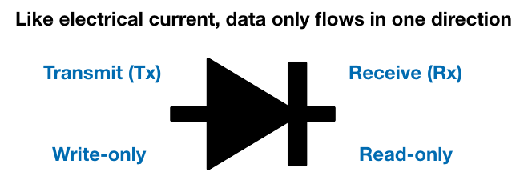

# What is OneWaySFTP?
One-way Transport of System Event Logs via SFTP. 

The idea is borrowed from data-diode. We upload (write-only) rotated log files to a specially configured SFTP server to:

1. **Deny** SSH/SCP access, only SFTP. *No special software required, just openssh-server.*
2. **Deny** read or directory listing to the */var/sftp/uploads with BindFS*; **write-only access**
3. **Detect** SSH/SCP failed attempts by logging a chroot environment. *Any of such attempts are reliable indicator of Privilege-Escalation because the credential/private-key can only be read by a non-interactive account with the SFTP script.* You can think of it as a trap.
4. **Deter** any over-writing attempt by using unix integer timestamp in the rotated file names. 
5. **Deter** from accessing SSH/SCP now that I revealed that it is a trap ;)

This approach is used together with another project: **Sysmon Visualization** which I will release after tidying it up.

# Comparison

|                                                              | OneWaySFTP | Syslog  | Windows Event Forward                    |
| ------------------------------------------------------------ | ---------- | ------- | :--------------------------------------- |
| Access Control                                               | Yes        | NO      | Using 'enterprise' PKI can be complex    |
| Complexity/Effort                                            | Low        | Low     | High & *only for Windows*                |
| [MiTM](https://en.wikipedia.org/wiki/Man-in-the-middle_attack) Detection | Yes        | NO      | Yes. Hey it's PKI!                       |
| Intrusion Detection                                          | Yes        | NO      | NO                                       |
| Encrypted Transport                                          | Yes        | NO      | Depends (some use plain HTTP)            |
| "Cloud friendly"                                             | Yes        | NO      | Depends. Usually within Intranet.        |
| Cost                                                         | Free       | Depends | Skill-set for PKI, AD... etc is not free |

**If you are using Syslog, please at least enforce network access control, otherwise anyone can spam it with rubbish.**

# Installations

[oneWaySFTPsetup.sh](https://github.com/jymcheong/OneWaySFTP/blob/master/oneWaySFTPsetup.sh) was tested with Ubuntu 17.10 but can be adapted to your preferred Linux. A quick outline of what it is doing:

1. [First block](https://github.com/jymcheong/OneWaySFTP/blob/58142c5ab4c933829af0bc86fda954364d98b4eb/oneWaySFTPsetup.sh#L3) of commands are related to creating **uploader** account & directory permission
2. [Second block](https://github.com/jymcheong/OneWaySFTP/blob/58142c5ab4c933829af0bc86fda954364d98b4eb/oneWaySFTPsetup.sh#L10) is related to setting up "[chrooted](https://en.wikipedia.org/wiki/Chroot)" SFTP only access by **reconfiguring /etc/ssh/sshd_config** 
3. [Third block](https://github.com/jymcheong/OneWaySFTP/blob/58142c5ab4c933829af0bc86fda954364d98b4eb/oneWaySFTPsetup.sh#L28) enables Rsyslog logging within a chrooted directory.
4. [Final block](https://github.com/jymcheong/OneWaySFTP/blob/58142c5ab4c933829af0bc86fda954364d98b4eb/oneWaySFTPsetup.sh#L36) downloads stable Bindfs version that includes **--delete-deny**, the one in Ubuntu repo may not have that option. The magic of write-only is implemented with [BindFS](https://bindfs.org).